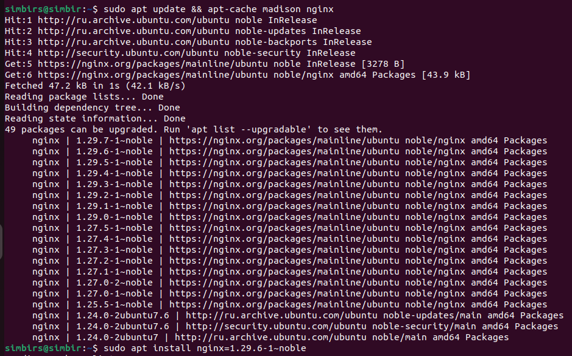
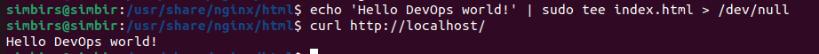
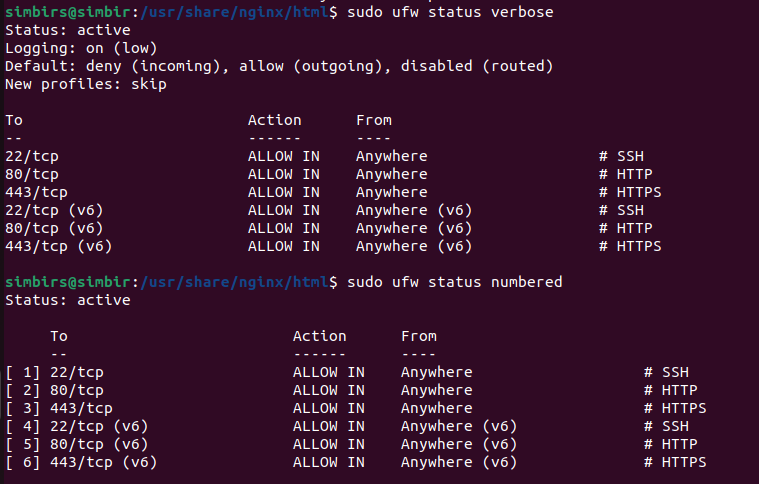
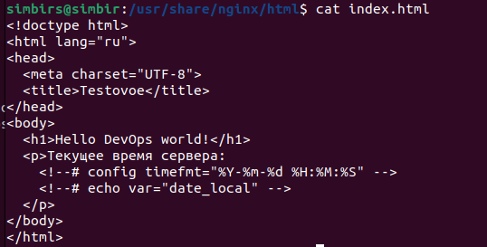
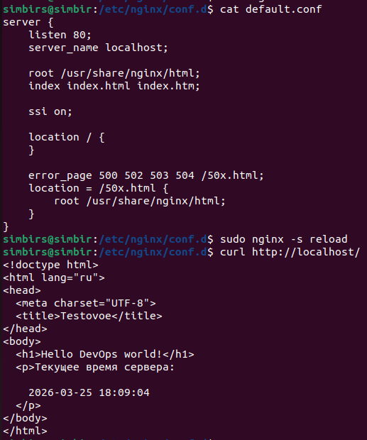
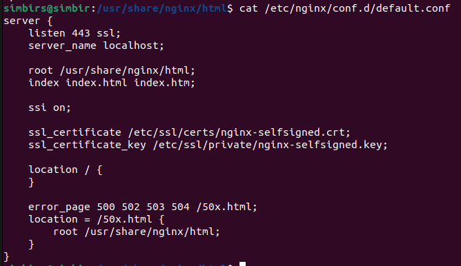
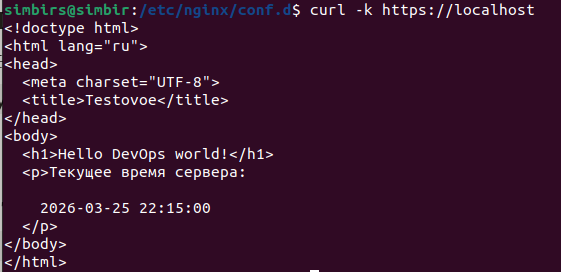

## 1) в виртуальной машине или контейнерной среде с любой ОС Linux установить прокси-сервер Nginx версии 1.29.6
### Установка зависимостей
*sudo apt install curl gnupg2 ca-certificates lsb-release ubuntu-keyring*

### Импортируем ключ
*curl https://nginx.org/keys/nginx_signing.key | gpg --dearmor | sudo tee /usr/share/keyrings/nginx-archive-keyring.gpg >/dev/null*

### Подключение mainline репозиторий
*echo "deb [signed-by=/usr/share/keyrings/nginx-archive-keyring.gpg] https://nginx.org/packages/mainline/ubuntu `lsb_release -cs` nginx" \
| sudo tee /etc/apt/sources.list.d/nginx.list*

### Включаем pinnig
echo -e "Package: *\nPin: origin nginx.org\nPin: release o=nginx\nPin-Priority: 900\n" | sudo tee /etc/apt/preferences.d/99nginx

### Устанавливаем нужную версию
*sudo apt install nginx=1.29.6-1~noble*

## 2) при открытии страницы сервера на 80 порту в браузере должен выводиться статический текст 'Hello DevOps world!'

## 3) настроить и установить любой файерволл, чтобы разрешил подключения к серверу на 80 443 и 22 порты, а все остальное блокировал, продемонстрировать
### Устанавливаем файерволл
sudo apt install -y ufw 

### Настраиваем до начальных настроек файерволл запрещаем исходящий и разрешаем входящий траффик
sudo ufw --force reset
sudo ufw default deny incoming
sudo ufw default allow outgoing

### Открываем нужные порты
sudo ufw allow 22/tcp comment 'SSH'
sudo ufw allow 80/tcp comment 'HTTP'
sudo ufw allow 443/tcp comment 'HTTPS'

## 4*) на статической странице выводится время, либо текущее, либо с отставанием от системного не более 1 минуты
  

## 5*) при обращении к порту 443 открывается та же страница, но с использованием ssl шифрования (сертификат может быть самоподписанным)
### Генерируем сертификат и ключ
sudo openssl req -x509 -nodes -days 365 -newkey rsa:2048   -keyout /etc/ssl/private/nginx-selfsigned.key   -out /etc/ssl/certs/nginx-selfsigned.crt   -subj "/CN=localhost"

  
